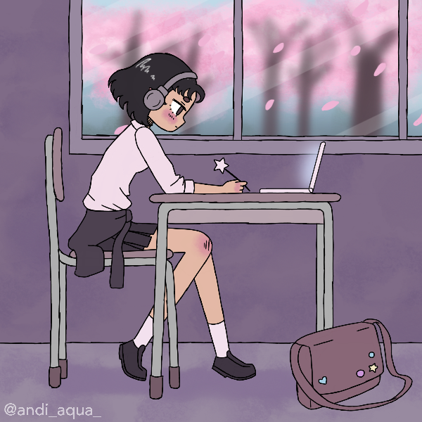

Uma entusiasta da tecnologia atualmente dedicada aos estudos em Análise e Desenvolvimento de Sistemas na Facens (Faculdade de Engenharia de Sorocaba). Meu percurso acadêmico inclui dois anos de formação em Ciências da Computação pela UFSCar, complementados por um diploma técnico em Administração.

Minha paixão pela área de tecnologia se reflete na minha versatilidade, abrangendo tanto o desenvolvimento front-end quanto back-end. Tenho proficiência em linguagens como Java e JavaScript, as quais utilizo para criar soluções inovadoras. Permaneço constantemente atualizada, pois acredito que o aprendizado contínuo é essencial no cenário tecnológico em constante evolução.

<h3 align="left">Connect with me </h3>
 

<h3 align="left">My Stack</h3>

  
  
  
  
  
  
  
  
  
  
  
  
  
  
  
  
  
  
  

###

<h3 align="left">GitHub Stats</h3>

<picture>
  <source media="(prefers-color-scheme: dark)" srcset="https://raw.githubusercontent.com/mari4souza/mari4souza/output/github-contribution-grid-snake-dark.svg">
  <source media="(prefers-color-scheme: light)" srcset="https://raw.githubusercontent.com/mari4souza/mari4souza/output/github-contribution-grid-snake.svg">
  
</picture>
 
 

  

 
 
  - Badges by <a href="https://shields.io/">shields.io</a> 
  - GitHub Stats by <a href="https://github.com/anuraghazra/github-readme-stats">anuraghazra</a>
  - Student avatar made in picrew by <a href="https://picrew.me/en">@andi_aqua_</a> 
    
 
  
Made with 💜 by <a href="https://github.com/mari4souza">mari4souza</a>.

